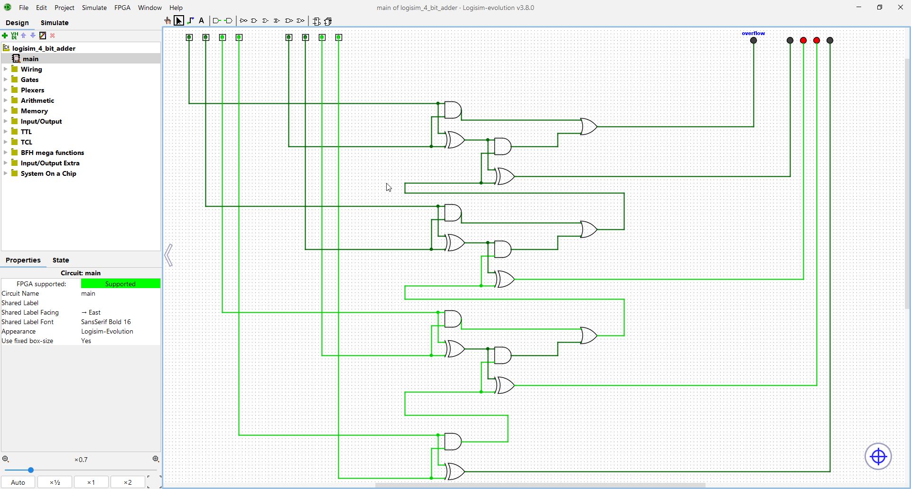

# 4 bit adder

[Verilog HDL with Quartus and Modelsim](https://www.youtube.com/playlist?list=PLXHMvqUANAFPO4id07GQggl64FS06TYWN) - Playlist to learn Verilog and ModelSim

---

This is a simple adder that I created as an intro to Logisim, ModelSim and Verilog.

The graphical design was made in Logisim and simulations were made in ModelSim.
