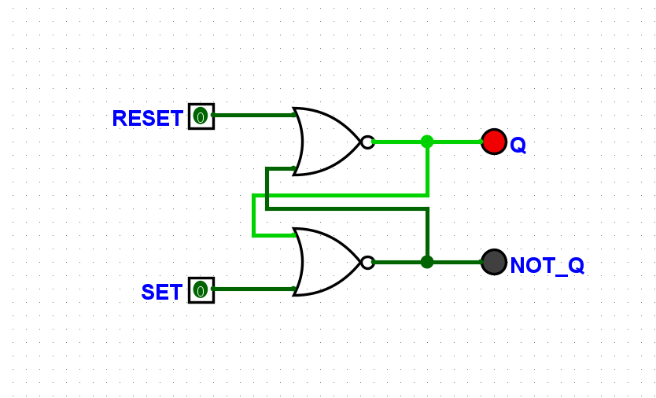
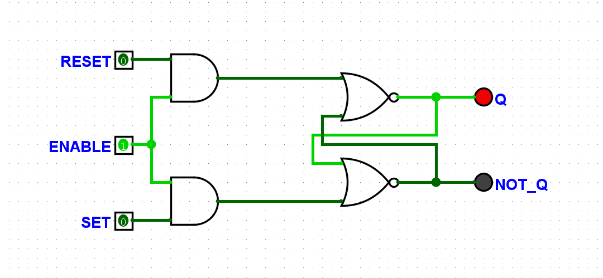
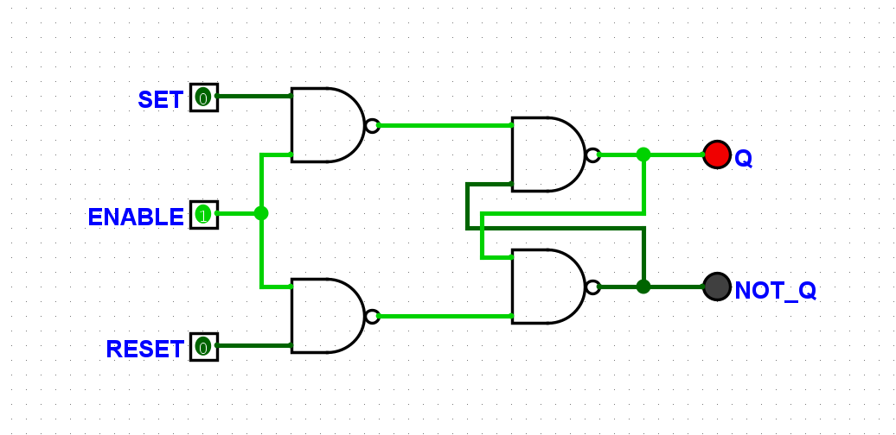
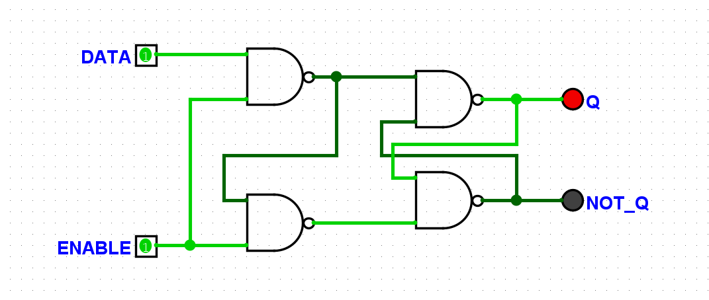
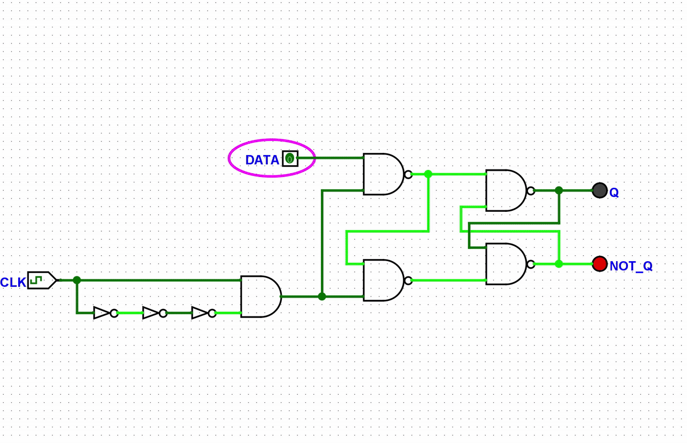
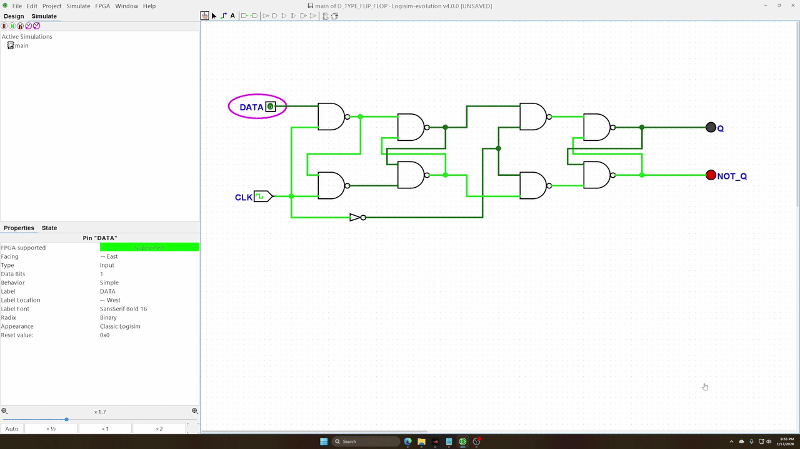

# Latches and Flip-Flops

This directory contains a collection of basic and clocked memory elements implemented in Logisim.
Each component includes its Logisim circuit file and a rendered screenshot for quick reference.

The designs progress from simple SR latches to gated latches and finally to edge-triggered D flip-flops, illustrating the evolution of synchronous storage elements.

Learn about Latches and Flop-Flops [from this amazing playlist](https://www.youtube.com/playlist?list=PLTd6ceoshpreKyY55hA4vpzAUv9hSut1H).

---

## SR Latch (NOR)

Files
- `SR_LATCH_NOR.circ`
- `SR_LATCH_NOR.png`

---

## SR Latch (NAND)

Files
- `SR_LATCH_NAND.circ`
- `SR_LATCH_NAND.png`

---

## Gated SR Latch (NOR)

Files
- `GATED_SR_LATCH_NOR.circ`
- `GATED_SR_LATCH_NOR.png`

---

## Gated SR Latch (NAND)

Files
- `GATED_SR_LATCH_NAND.circ`
- `GATED_SR_LATCH_NAND.png`

---

## Gated D Latch

Files
- `GATED_D_LATCH.circ`
- `GATED_D_LATCH.png`

---

## Clocked D Latch

Files
- `CLOCKED_D_LATCH.circ`
- `CLOCKED_D_LATCH.png`
- `CLOCKED_D_LATCH.gif`

---

## D-Type Flip-Flop

Files
- `D_TYPE_FLIP_FLOP.circ`
- `D_TYPE_FLIP_FLOP.png`
- `D_TYPE_FLIP_FLOP.gif`

---

## Building Order

1. SR Latch (NOR / NAND)
2. Gated SR Latch
3. Gated D Latch
4. Clocked D Latch
5. D-Type Flip-Flop
